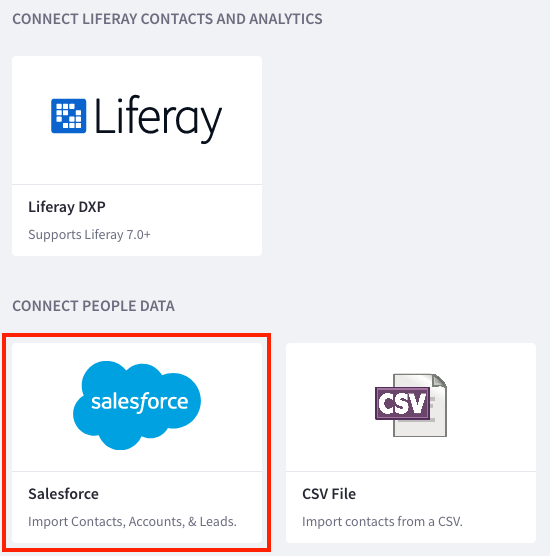
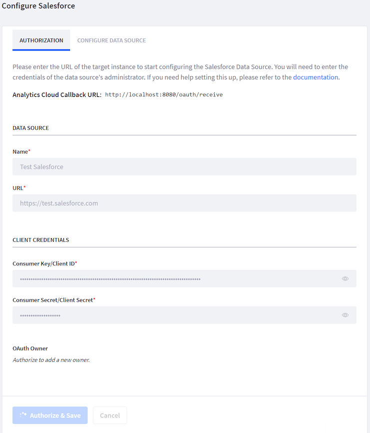
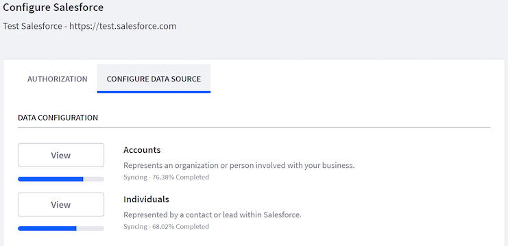

# Adding a Salesforce Data Source

Analytics Cloud can integrate Salesforce data with data from Liferay DXP and other sources, automatically blending the data to build a comprehensive customer profile. This lets you create more accurate segmentation and enhance your site’s personalization strategy. To do this, you must first add a Salesforce instance as a data source.

## Adding the Data Source

1. Select *Settings* → *Data Sources* → *Add Data Source*. This opens the Add Data Source screen.

1. Select *Salesforce*. This opens the Configure Salesforce screen.

    

1. In the *Authorization* tab, enter the Salesforce instance’s name and URL. Under the *CLIENT CREDENTIALS* section, enter the client ID and client secret of the OAuth connected app in Salesforce.

    ```{note}
    the Salesforce instance’s administrator must create this connected app with the following settings:

    * Callback URL: https://analytics.liferay.com/oauth/receive
    * OAuth Scopes: - Access your basic information (id, profile, email address, phone) - Access and manage your data (api) - Perform requests on your behalf at any time (refresh_token, offline_access)

    For instructions on creating an OAuth connected app in Salesforce and locating its client ID and client secret, see the [Salesforce documentation](https://help.salesforce.com/articleView?id=connected_app_overview.htm&type=5).
    ```

1. Click *Authorize & Save*. This begins importing the leads, contacts, and accounts data from Salesforce. This data is integrated with Analytics Cloud data as follows:

    * Data from Salesforce leads and contacts are merged with data for matching individuals in Analytics Cloud. The match is based on email address. For example, if a contact and/or lead has the same email address as an individual in Analytics Cloud, the data of that contact and/or lead is merged into that individual’s Analytics Cloud data.
    * If the email address of a lead and/or contact doesn’t match with that of an existing individual in Analytics Cloud, a new individual is created in Analytics Cloud with the data from the lead and/or contact.
    * Data from a contact is prioritized over that of a lead. For example, if the same field is populated in a matching lead and contact, then the data from the contact is imported into the individual in Analytics Cloud.

  Note that importing the data may take some time, depending how much data exists in the Salesforce instance.

1. The import progress is visible on the *CONFIGURE DATA SOURCE* tab. Click View to see the mapping of each Salesforce field (for Accounts and Individuals) to its corresponding Analytics Cloud field. You can also view this information later from *Settings* → *Data Sources* → *(Your Salesforce)* → *CONFIGURE DATA SOURCE*.




