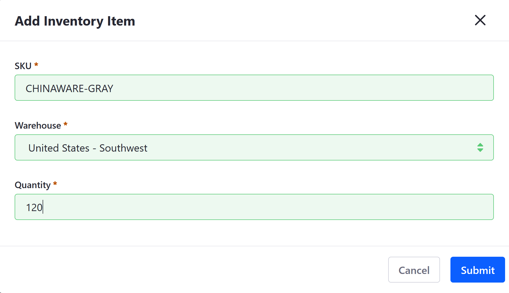
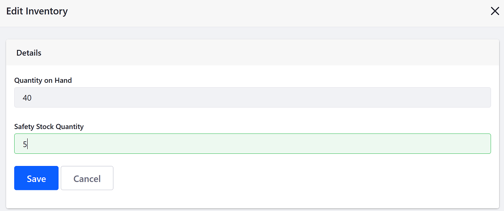

# Using the Inventory Management System

> Availability: Commerce 2.1+

Liferay Commerce's _Inventory Management_ system is a single place for users to manage inventory across an entire Liferay Commerce instance.

Users can add inventory items, view the list of orders for a particular item (SKU), designate Safety Stock, and view historical changes to items. Inventory Management is also tied to the warehouses; from here, users can also view the stock available in each warehouse.

To manage your inventory, go to the _Global Applications_ menu &rarr; _Commerce_ &rarr; _Inventory_.

```{note}
Inventory Management is located in the *Control Panel* if using Commerce 2.0 or 2.1.
```

## Adding an Inventory Item

Each inventory item is tracked by a SKU. Users can add multiple SKUs in the _Inventory Management_ and ensure that there is adequate quantities for each SKU.

To add an inventory item:

1. Navigate to the _Control Panel_ &rarr; _Commerce_ &rarr; _Inventory_.
1. Click the () icon.
1. Enter the following:

    * **SKU**: CHINAWARE-GRAY
    * **Warehouse**: United States - Southwest
    * **Quantity**: 120

    

1. Click _Submit_ when finished.

The new inventory item has been added.

```{important}
Each product in the inventory must be associated to at least one SKU.
```

## Setting Inventory Safety Stock

Safety Stock is product inventory that is physically located in a warehouse but has been to set aside and made unavailable for sale. This could be for a prospective order or the items are to be sold on a different channel. Once set, available stock for the item is reduced for the configured warehouse.

To set a safety stock quantity:

1. Click on the SKU (12 PACKMOCHA).
1. Click the 3-dot icon () &rarr; _Edit_ next to the warehouse.
1. Enter the following:

   * **Quantity on Hand**: 40 (leave as-is)
   * **Safety Stock Quantity**: 5

    

1. Click _Save_ when finished.
1. Close the window.

Once the Safety Stock quantity has been set, the number has decreased in the _Available_ column.


## Viewing On Orders

1. Click on the SKU (_MIN55681_).
1. Click the _On Order_ tab.

    

Users can view all the orders that include this SKU.

## Adding Incoming Stock

Store managers can enter incoming stock quantities and the expected delivery day.

1. Click on the SKU.
1. Click the _Incoming_ tab.
1. Click the () icon.
1. Enter the following:

    * **Quantity**: 20
    * **Destination**: Choose a warehouse (United States Northeast)
    * **Expected Delivery Date**: Choose a future date (7/01/2020)

    

1. Click _Submit_ when finished.

Once the incoming quantity has been added, this is updated on the _Overview_ tab.


## Viewing Inventory Changes

The Changelog tracks the following events:

* When an order is placed, the quantities are booked (allocated) to fulfill the order.
* When a shipment is created, the previously booked quantity is committed; the inventory is updated by removing the amount previously booked.
* When a quantity is added to the inventory
* When a quantity is moved between warehouses.
* When a shipment is cancelled, the previously allocated quantities need to be returned.
* Any update action to an inventory item.


## Additional Information

* [Inventory Management Reference Guide](./inventory-management-reference-guide.md)
* [Warehouse Reference Guide](./warehouse-reference-guide.md)
* [Setting Inventory by Warehouse](./setting-inventory-by-warehouse.md)
