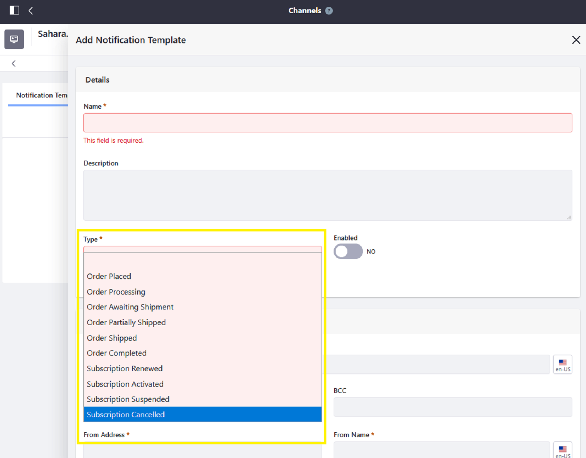
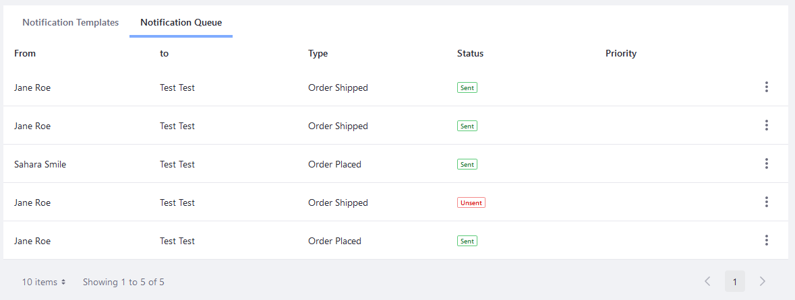

# Store Emails

Liferay Commerce can be configured to send email notifications that are triggered by a variety of store events. Templates are customizable and define the content of an email. A single event can be configured to trigger emails to different target audiences (a customer, a sales agent, an administrator) and use a template specific to each party.

```{note}
To use Liferay Commerce's Notifications feature, first configure the Mail settings for Liferay Digital Experience Platform (DXP). See [Configuring Mail](https://learn.liferay.com/dxp/latest/en/installation-and-upgrades/setting-up-liferay/configuring-mail.html) for more information.
```

## Configuring Store Email Notifications

Once the Liferay Commerce's mail settings have been configured, navigate to the _Control Panel_ &rarr; _Commerce_ &rarr; _Channels_ to begin creating store email notifications. Email notifications are configured per [channel](../../starting-a-store/channels/introduction-to-channels.md). Using an [accelerator](../../starting-a-store/accelerators.md) creates a store, catalog, and channel for you to start with.


## Event Triggers

There are ten events that can trigger email notifications. Use one of the corresponding out-of-the-box Notification Templates to create a standardized email notification.

| Notification Type | Event |
| --- | ---|
| Order Placed | The store has received an order. |
| Order Processing | The store has begun processing an order. |
| Order Awaiting Shipment | The order is ready to be shipped. |
| Order Partially Shipped | The customer is notified if the items are being shipped separately. |
| Order Shipped | The order has been shipped. |
| Order Completed | The order has been completed; delivery has been made. |
| Subscription Renewed | The subscription (recurring order) has been renewed. |
| Subscription Activated | The subscription has been activated. |
| Subscription Suspended | The subscription has been suspending pending review or action by the store. |
| Subscription Cancelled | The subscription has been cancelled. |



## Viewing the Notification Queue

You can view all email notifications in a channel's _Notification Queue_. Here, you can verify the status of emails that have been triggered by an event.



By default, the system checks the Notification Queue at 15 minute intervals for unsent notifications. See [Configuring the Commerce Notification Queue](./configuring-the-commerce-notification-queue.md) article to learn more about changing the Check Interval.

## Customizing an Email Notification Template

You can customize the Notification Templates with your own text and with the use of placeholder values to substitute for key values in the _Email Settings_ and _Body_ fields. Key values include a customer's name, the Order ID, shipping and billing addresses, and a list of items in the order.

For example, the _Email Body_ field can contain:

```
Dear [%ORDER_CREATOR%],

Your [%ORDER_ID%] has been shipped to [%ORDER_SHIPPING_ADDRESS%].
```

The variables are then replaced with the relevant content when sending the email.

See the [Notification Template Variables Reference Guide](./notification-template-variables-reference-guide.md) article to learn more.

## Viewing Order Communications History

Email notifications related to an order are tracked and can be reviewed in the *Emails* tab when viewing an order. Navigate to the _Control Panel_ &rarr; _Commerce_ &rarr; _Orders_. Click on an Order ID then the _Email_ tab. See [Orders Information](../../orders-and-fulfillment/orders/order-information.md) to learn more.


## Additional Information

* [Using Notification Templates](./using-notification-templates.md)
* [Configuring the Commerce Notification Queue](./configuring-the-commerce-notification-queue.md)
* [Notification Template Variables Reference Guide](./notification-template-variables-reference-guide.md)
