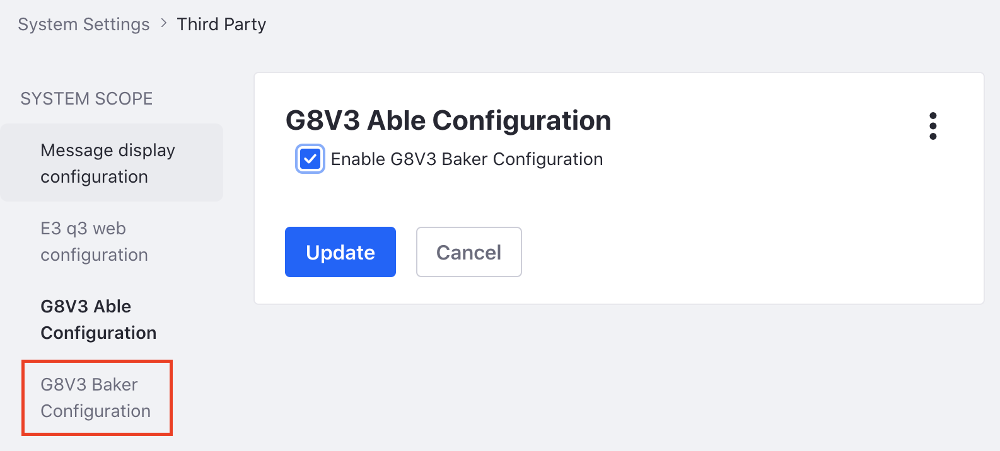

# Hiding the Configuration UI

Liferay generates a configuration UI automatically after a [configuration interface deploys](./setting-and-accessing-configurations.html#creating-the-configuration-interface). But you may have certain use cases where you want to hide the UI. For example, you don't want an administrator to have access to a specific configuration or you want to hide the configuration based on certain criteria. To hide the configuration UI, you have two different options:

* Use a `generateUI` annotation property
* Use the configuration visibility interface

## Using `generateUI`

If you want to hide the configuration UI under all circumstances, include the `ExtendedObjectClassDefinition` annotation property `generateUI` in your configuration interface. Set the property to `false`. Note that this hides the configuration UI for all scopes.

```java
@ExtendedObjectClassDefinition(generateUI=false)
```

## Using the Configuration Visibility Interface

Use the `ConfigurationVisibilityController` interface if you want to hide the configuration UI selectively.

### See an Example Implementation

1. Start Liferay DXP. If you don't already have a docker container, use

    ```bash
    docker run -it -m 8g -p 8080:8080 [$LIFERAY_LEARN_PORTAL_DOCKER_IMAGE$]
    ```

1. Download and unzip [Hiding the Configuration UI](./liferay-g8v3.zip)

    ```bash
    curl https://learn.liferay.com/dxp/latest/en/building-applications/core-frameworks/configuration-framework/liferay-g8v3.zip -O
    ```

    ```bash
    unzip liferay-g8v3.zip
    ```

1. From the module root, build and deploy.

    ```bash
    ./gradlew deploy -Ddeploy.docker.container.id=$(docker ps -lq)
    ```

    ```{note}
    This command is the same as copying the deployed jars to /opt/liferay/osgi/modules on the Docker container.
    ```

1. Confirm the deployment in the Liferay Docker container console.

    ```
    STARTED com.acme.g8v3.impl_1.0.0 [1650]
    ```

1. Open your browser to `https://localhost:8080` and navigate to *Control Panel* &rarr; *Configuration* &rarr; *System Settings*. Under Platform click *Third Party*. Click *G8V3 Able Configuration* on the left. Check the box for Enable G8V3 Baker Configuration. Click the *Update* button.

    

1. Notice that when this checkbox is not enabled the G8V3 Baker Configuration is hidden.

### Implement the Interface

Create the configuration visibility interface for your application. 

```{literalinclude} ./hiding-the-configuration-ui/resources/liferay-g8v3.zip/g8v3-impl/src/main/java/com/acme/g8v3/internal/configuration/admin/display/G8V3BakerConfigurationVisibilityController.java
:language: java
:lines: 17-48
```

Identify the configuration interface with the `@Component` annotation. Note that the `configuration.pid` in the `Component` annotation must match the fully qualified class name of the configuration interface.

Write your own logic for the interface's `isVisible()` method. The example project uses a simple logic to check the boolean setting of G8V3 Able Configuration. In your application, design your own programming logic to hide or show the configuration UI.
