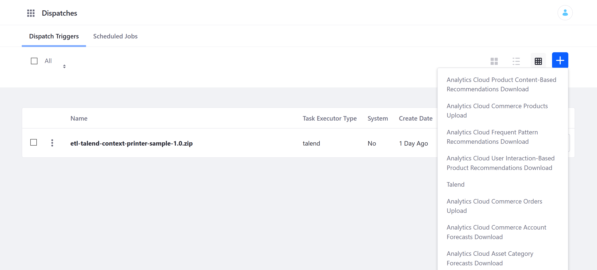
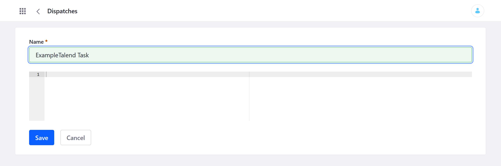
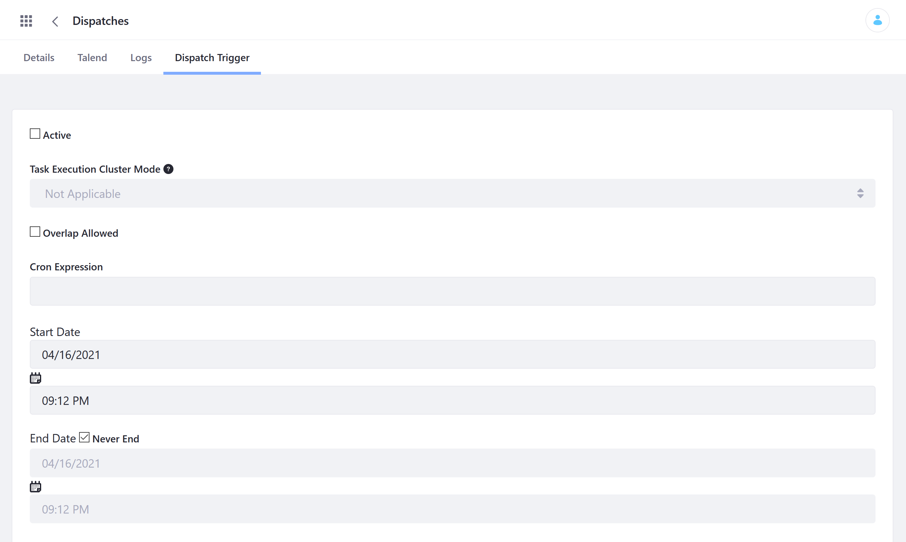
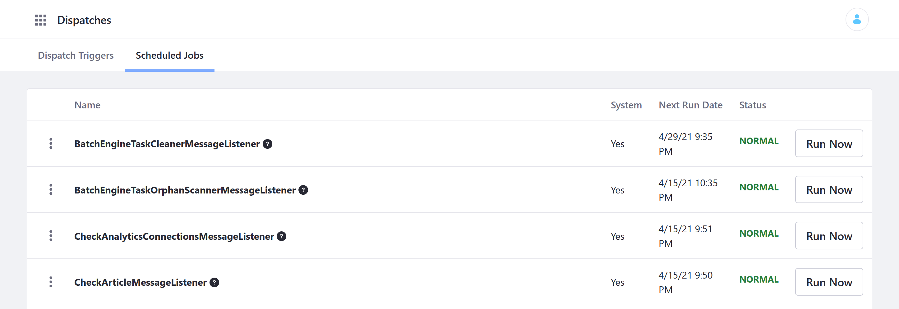

# Using Dispatch

[Dispatch](https://github.com/liferay/liferay-portal/tree/master/modules/apps/dispatch) is a flexible framework built on top of Liferay's scheduler engine that you can use to run and schedule any type of logic. This framework uses the `DispatchTaskExecutor` interface to define templates with custom logic that you can use to [create tasks](#adding-a-new-dispatch-task) via the Control Panel. Once a Dispatch Task is created, you can configure its behavior and execution [schedule](#scheduling-the-dispatch-task).


Dispatch provides a convenient UI for viewing and managing all instance [jobs scheduled using the `MessageListener` interface](#viewing-and-managing-scheduled-jobs).

```{note}
When deciding whether to use Dispatch or `MessageListener` to schedule instance jobs, consider the following Dispatch benefits.
Dispatch Tasks are more flexible than jobs scheduled using `MessageListener`, since changes can be applied to Dispatch Tasks in runtime through the Dispatch UI. Changes to `MessageListener` jobs must be hardcoded and redeployed. 
The Dispatch UI also provides a more complete overview of each Dispatch Task's execution properties (e.g., cron expression, start/end date, cluster mode) and execution history. This information is not provided in the UI for `MessageListener` jobs.
```

## Adding a New Dispatch Task

1. Open the *Global Menu* (), click *Control Panel*, and go to *Configuration* &rarr; *Dispatch*.

1. Click the *Add* button () and select the desired template for your Dispatch Task. The selected template defines the Task's essential logic.

   Each template is an implementation of the `DispatchTaskExecutor` interface, and each Dispatch Task is an instance of the selected template. See [Understanding the Dispatch Framework](./understanding-the-dispatch-framework.md) for more information about how it works.

   ```{note}
   Liferay DXP provides a variety of Dispatch Task templates, while Liferay Portal only includes the Talend Dispatch Task Executor.

   You can also create your own templates. See [Creating a New Dispatch Task Executor](./creating-a-new-dispatch-task-executor.md) to learn how.
   ```

   

1. Enter a name for the Dispatch Task.

1. (Optional) Use the settings editor to define properties for the Dispatch Task that are injected at runtime.

   These settings can be used to fine tune execution flow and more.

   All settings added in this way are soft-coded, so you can configure your Dispatch Tasks without having to edit and redeploy the Executor's code.

   ```{tip}
   You can create multiple instances of the same Dispatch Task Executor and modify their properties and behavior using the settings editor.
   ```

1. Click *Save* to create a new Dispatch Task for the selected template.

   

All Dispatch Tasks added to an instance appear on the Dispatch page. From here, you can click the task to edit its settings or configure its Dispatch Trigger to schedule when it runs. You can also click *Run Now* to execute the task manually. The Logs tab shows a record of all executions for the selected Dispatch Task.


## Scheduling the Dispatch Task

By default, all Dispatch Task Triggers are deactivated at creation. Follow these steps to activate a Task's Dispatch Trigger and schedule when it runs:

1. Go to the *Dispatch Triggers* tab in the Dispatch page and click the desired Dispatch Task.

1. Click the *Dispatch Trigger* tab and configure the fields below.

1. Click *Save*.

   

**Active**: Activate or deactivate the Dispatch Trigger. To activate the Trigger, you must enter a valid cron expression. When active, the Dispatch task executes according to the set schedule. Deactivating it prevents the Trigger from running.

**Task Execution ClusterMode**: Determine whether the Dispatch Task is run on one or all nodes in a clustered environment.

**Overlap Allowed**: Enable or disable  concurrent execution for the Dispatch Task. When enabled, new task executions are initiated according to the set schedule, regardless of whether a previous execution is still running.

**Cron Expression**: Enter a valid Cron expression to determine when the Dispatch Task is executed.

**Start Date**: Determine the Dispatch Task's start date.

**End Date**: Use the checkbox to determine when the Dispatch Task is no longer executed by the cron schedule. It is set to the current date and time by default.

The Dispatch Task now automatically starts and stops at your specified date/time and according to the cron intervals.

## Setting Up a Talend Dispatch Task

Talend is open source data integration software for defining custom data integration jobs. These jobs can be exported as a `.zip` archive and uploaded to any Dispatch Task that uses the Talend executor template. Once uploaded, the Talend data integration job is executed whenever the Dispatch Task is run.

Follow these steps to upload a Talend *Job Archive* to a Dispatch Task:

1. Add a new Dispatch Task to your instance using the Talend executor template. See [Adding a New Dispatch Task](#adding-a-new-dispatch-task) for detailed instructions.

1. Go to the *Dispatch Triggers* tab in the Dispatch page, and click on the desired Dispatch Task.

1. Click the *Talend* tab.

   

1. Upload the ZIP file for your Talend *Job Archive*.

1. Click *Save*.

## Viewing and Managing Scheduled Jobs

The Dispatch Page's *Scheduled Jobs* tab also lists all jobs scheduled on the Liferay instance using the `MessageListener` interface. Here you can view general details for each job (e.g., name, status), as well as manually initiate runs or pause/resume jobs individually.



## Additional Information

* [Dispatch UI Reference](./dispatch-ui-reference.md)
* [Understanding the Dispatch Framework](./understanding-the-dispatch-framework.md)
* [Creating a New Dispatch Task Executor](./creating-a-new-dispatch-task-executor.md)
