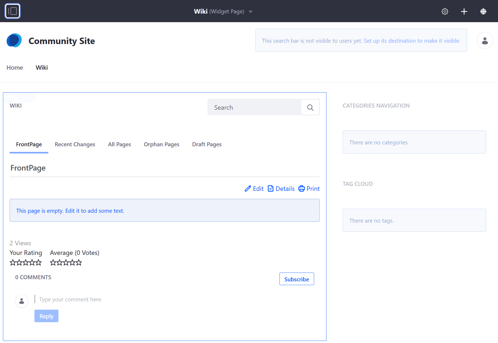
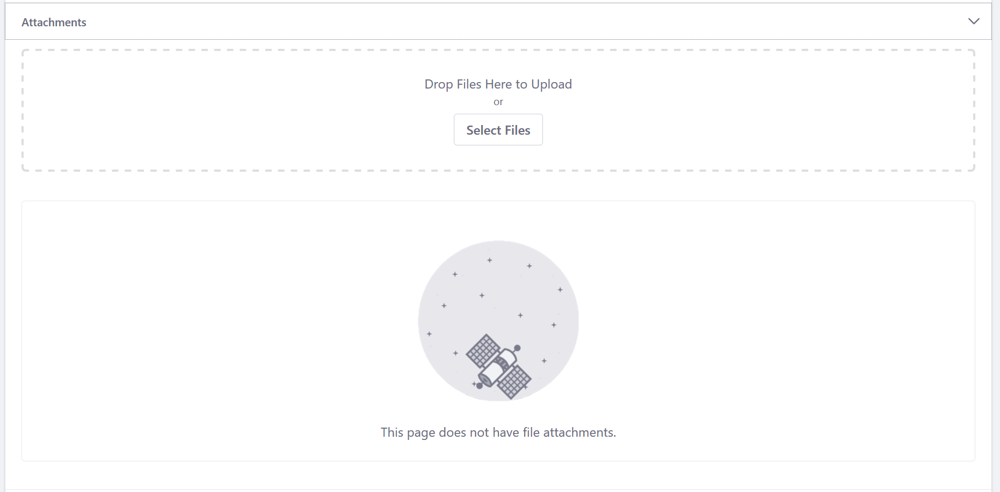
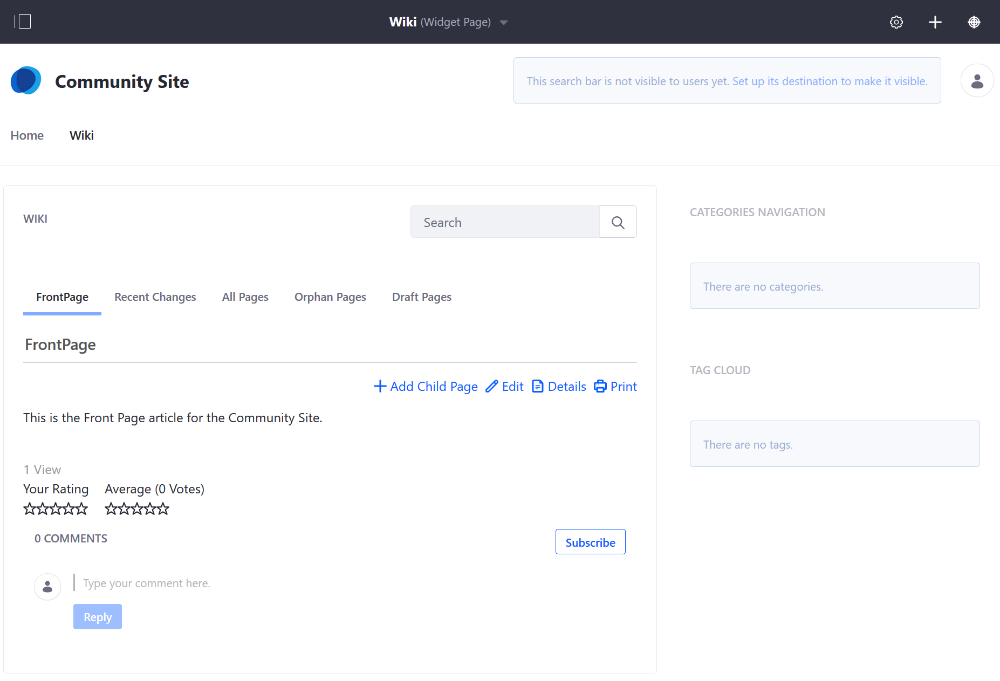
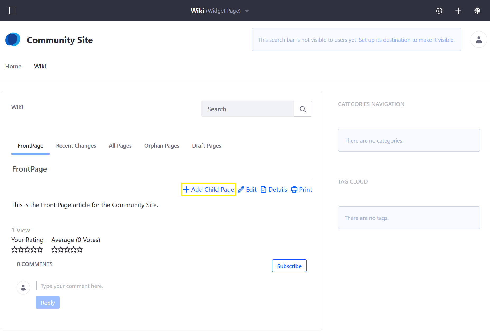
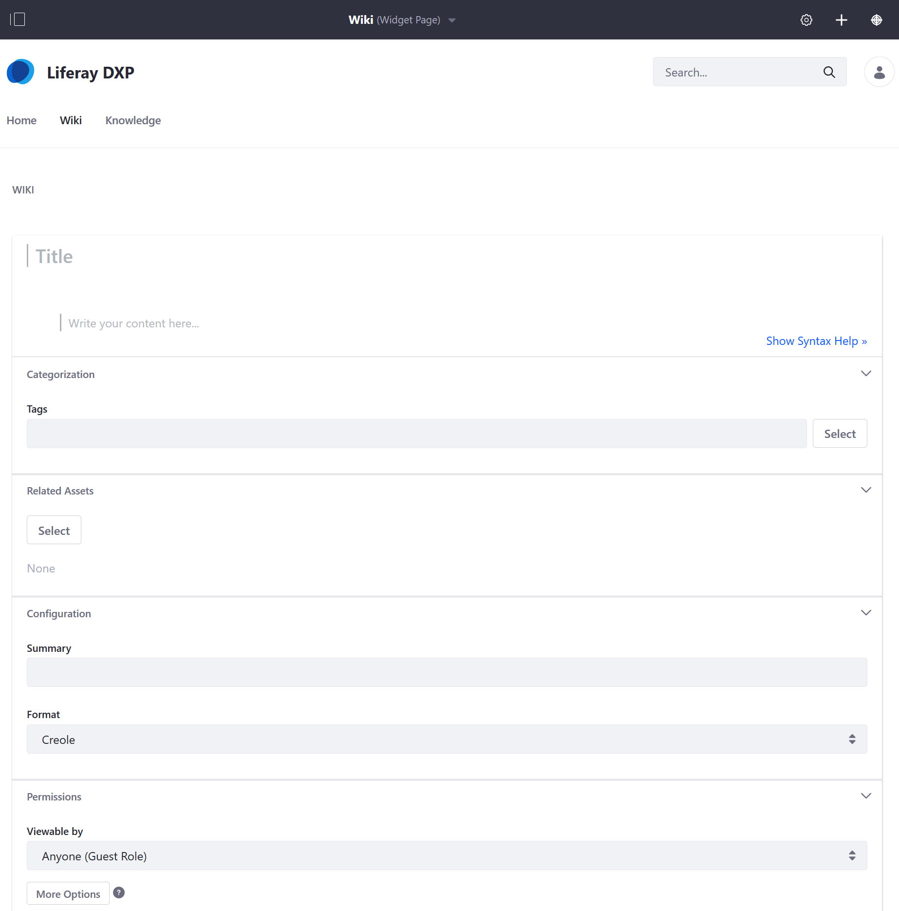
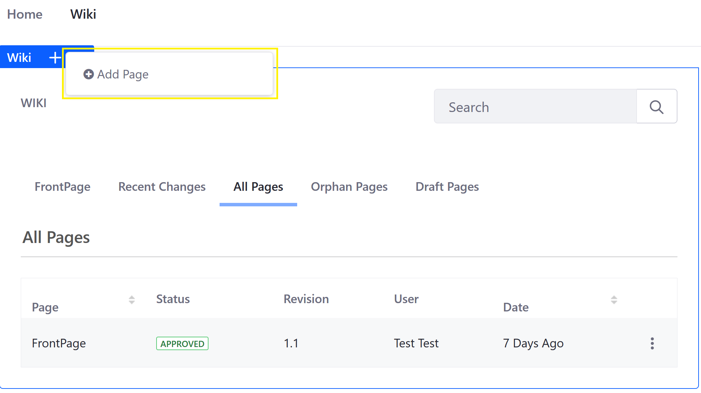
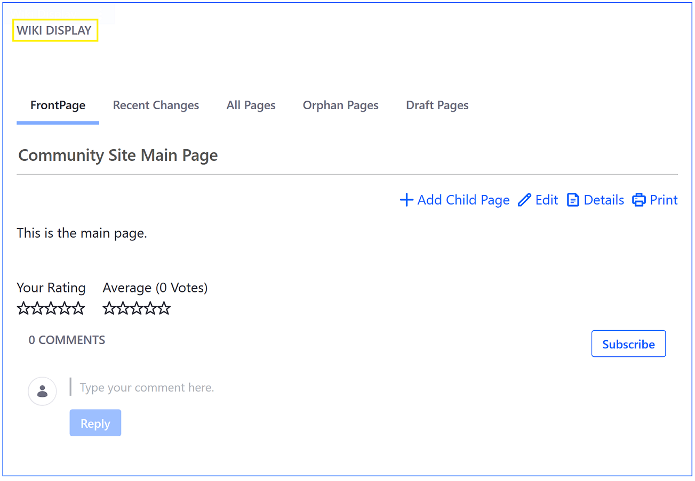

# Creating Wiki Pages

The _Wiki_ widget starts with a default wiki page called _FrontPage_. Users can edit this page to make their first wiki page.

By default, only authenticated users have the ability to create _Wiki_ articles; guests must sign in first.

## Creating Content on the _FrontPage_

1. Navigate to the site page where the _Wiki_ widget is deployed.

    

1. To modify the _FrontPage_, click the _This page is empty. Edit it to add some text._ link in the box.
1. Tne default text editor uses Creole. To switch the format, expand the _Configuration_ section.

    

1. Select a new format (HTML) then click _OK_ to accept the change.
1. Enter the article's content.

### Uploading an Attachment

Users can attach files to wiki pages.

1. To add attachments, expand the _Attachments_ section.
1. Drag and drop a file to upload or use the _Select Files_ button to navigate to the file's location.

    

```{important}
You can enable automatic antivirus scanning to scan files on upload. For details, please see [Enabling Antivirus Scanning for Uploaded Files](../../system-administration/file-storage/enabling-antivirus-scanning-for-uploaded-files.md).
```

### Using Tags and Related Assets to Organize Wiki Pages

Users can add a tag to a page. If searching for content using this tag (for example, _Toyota_), all posts with the _Toyota_ will be returned faster.

1. Expand the _Categorization_ section.
1. Click the _Select_ button to select an existing tag. Alternately, create a new tag by entering the tag name in the _Tags_ field and clicking _Add_. See [the documentation on tags](https://help.liferay.com/hc/articles/360028820472-Tagging-Content) for more information.

1. Click _Publish_ when finished.



The _FrontPage_ article has been created.

## Creating Child Pages

Once the _FrontPage_ Page has been created, users can create a _Child Page_. This creates a simple parent-child hierarchy of wiki pages. A _Wiki Child Page_ could have child articles of its own even as it also belongs to a parent page. To create a _Child Page_, click _Add Child Page_.



It opens the same _Wiki_ page editor.



## Creating Other Top Level Pages

As noted above in the _Creating Child Pages_, future wiki pages are created as child pages for organizational purposes. To create another top-level page:

1. Click the _All Pages_ tab.
1. Mouse over the _Wiki_ widget's menu and click _Add Page_.

   

This opens the same _Wiki_ page editor.

A _Wiki_ widget can have multiple top-level pages; while the main _Wiki_ widget displays only the _FrontPage_ wiki page, site content creators can use the [Wiki Display Widget](./using-the-wiki-display-widget.md) to display the other top-level pages.



## What's Next

* [Creating a Node](./creating-a-node.md)
* [Using the Wiki Display Widget](./using-the-wiki-display-widget.md)
