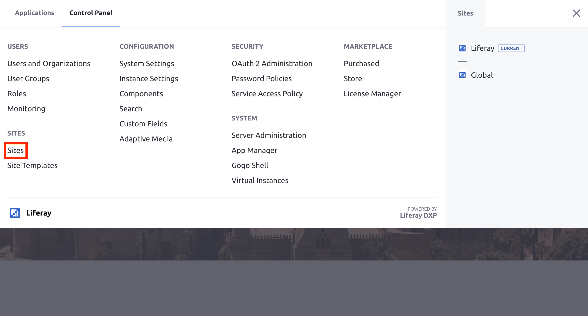
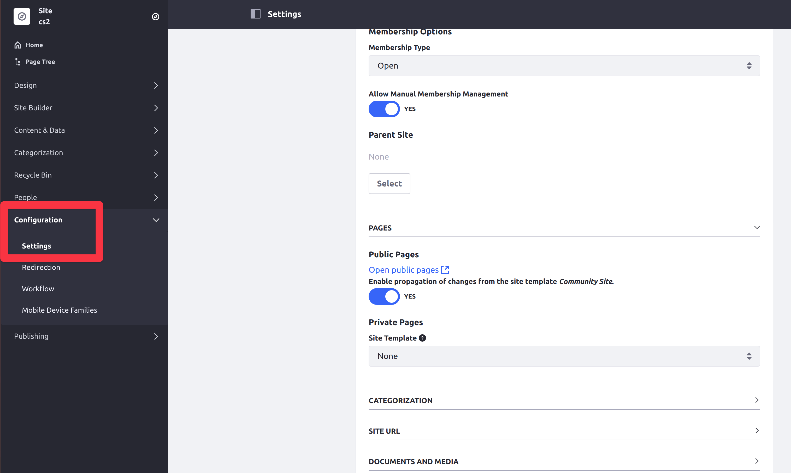

# Building Sites with Site Templates

Site Templates define a preconfigured structure for a Site, which includes the pages, theme, content, layouts, page templates, applications and app configurations defined for each page. Changes made to a Site Template are automatically propagated to the sites that use it, unless specified otherwise.

```{note}
While Site Templates propagate changes to a Site, they should not be used as a means of propagating Site data. To propagate Site data, [export the data and import it into another Site](./importing-exporting-pages-and-content.md) instead.
```

Three Site Templates are provided out-of-the-box:

- **Blank Site:** Creates a Site that doesn't contain any Pages or content.

- **Community Site:** Creates a preconfigured Site with the Message Boards, Search, Polls, Recent Content, Wiki, and navigation applications pre-deployed to Site Pages.

- **Intranet Site:** Creates a preconfigured Site for an intranet. The Home page displays the Site members' activities, a language selector, and a list of the recent content created in the intranet on the home page. It also provides two additional pages for Documents and Media and external News obtained through public feeds.

## Creating a Site from a Site Template

To create a Site using a Site Template, follow these steps:

1. Open the [Global Menu](../../getting-started/navigating-dxp.md) (  ) and go to *Control Panel* &rarr; *Sites*.

    

1. Click the *Add* icon () and select your Site Template from the menu.

1. Enter a name for the Site.

    ```{note}
    Checking the *Create default pages as private (available only to members).* box prevents guest users from viewing Site pages.
    ```

1. Click *Save*.

1. Configure your [Site settings](../site-settings/site-settings-ui-reference.md).

    - In Liferay DXP 7.4+

      1. From the Site Menu, go to *Configuration* &rarr; *Site Settings*.
      1. In the Content and Data section, click *Pages*.
      1. Under the Site Scope, click *Pages*.

            

    - In previous Liferay DXP versions

      1. From the Site Menu, go to *Configuration* &rarr; *Settings*.
      1. Under the General area, expand the *Pages* section.

            

    ```{note}
    *Enable propagation of changes from the Site Template* enables the Site to receive updates if the Site Template is modified. If changes are made directly to a Site created from a Site Template, the Site will no longer receive updates from the Site Template. See [Merging Site Template Changes](./merging-site-template-changes.md) for more information.
    ```

1. Click *Save* to create your Site.

1. Open the Global Menu (  ) and go to *Sites* under the *Control Panel* tab.

1. Click *Actions* (  ) beside your new Site and select *Go to Public Pages* or *Go to Private Pages* to view it.

    ```{tip}
    To view a newly created *blank site*, you must first create a page for it. See [Adding a Page to a Site](../creating-pages/adding-pages/adding-a-page-to-a-site.md) for more information.
    ```

## Related Information

- [Introduction to Site Building](../introduction-to-site-building.md)
- [Creating a Site Template](./building-sites-with-site-templates.md)
- [Adding Members to Sites](./site-membership/adding-members-to-sites.md)
