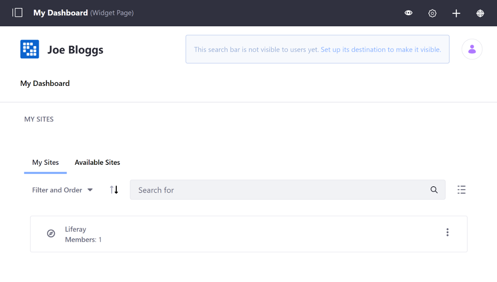
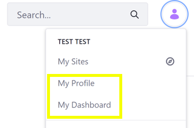

# Managing Personal Sites

By default, every User created in Liferay DXP has a Personal Site generated for them, of which they are the only member, that consists of public (Profile) pages and private (Dashboard) pages. This per-user Personal Site can be [easily disabled](#customizing-personal-sites-with-portal-properties) if this behavior is not desired.

## Profile Pages and Dashboard Pages

The Public Pages (Profile) of a User's Personal Site can be used for anything that the User wants to share publicly, such as a Blog (via a blog entry Widget) or their activities (via the Activities widget) so other users can see what they've been up to. By default, it displays basic information about the User and provides a link for a vCard (virtual business card) to download the User's contact info.


The Private Pages (Dashboard) of a User's Personal Site can be used to view personal information, such as a private file repository (via the Documents and Media widget) or a personalized RSS feed (via the RSS reader widget), and manage items, such as the Site you belong to (via the My Sites widget) or an Organization you administrator.



## Managing Personal Site Pages

To access your Personal Site pages, follow these steps:

1. Open the Personal Menu icon and select either *My Profile* or *My Dashboard*.

    

1. Open the Product Menu and go to *Site Builder* &rarr; *Pages* under the Site Menu.

1. Manage the pages as you would any other [Widget Page](../creating-pages/using-widget-pages/adding-widgets-to-a-pag

    ```{tip}
    You can switch between the Dashboard and Profile pages from the Pages page by switching between the Public Pages and Private Pages menus and selecting the *View* option from the page's Actions Menu.
    ```

You can also add and define pages for a User's Personal Site via a User Group. See [User Group Sites](../../users-and-permissions/user-groups/user-group-sites.md) for more information.

## Personal Site Permissions and Roles

Permissions and Roles for personal sites follow the behavior shown below:

- Administrators can customize the modifiable portions of personal Sites through Liferay Portal's permissions system by removing permissions from Roles (disallow all Users from modifying something by removing the relevant permission from the User Role).
- Users can administer their personal sites and modify the pages and applications when they are members of the [Power User Role](../../users-and-permissions/roles-and-permissions/default-roles-reference.md#regular-roles).

## Customizing Personal Sites with Portal Properties

There are several portal properties you can add to [`portal-ext.properties`](../../installation-and-upgrades/reference/portal-properties.md) to customize the default pages of personal Sites. You can customize the names of the pages, the applications that appear on the pages, the themes and layout templates of pages, and more. Please refer to the [Default User Public Layouts](https://learn.liferay.com/reference/latest/en/dxp/propertiesdoc/portal.properties.html#Default%20User%20Public%20Layouts) and [Default User Private Layouts](https://learn.liferay.com/reference/latest/en/dxp/propertiesdoc/portal.properties.html#Default%20User%20Private%20Layouts) sections of the `portal.properties` file for details. Some of these properties are listed in the table below:

| Functionality | Property |
| --- | --- |
| Disable personal Sites | `layout.user.public.layouts.enabled=false`
| Disable Private Pages on personal Sites | `layout.user.private.layouts.enabled=false` |
| Disable automatic creation of personal Sites | `layout.user.public.layouts.auto.create=false`
| Disable automatic creation of Private Pages on personal Sites | `layout.user.private.layouts.auto.create=false` |

The Public and Private Page Sets of personal Sites are handled separately. You can leave one Page Set enabled while disabling the other. If you initially had user personal Sites enabled for your instance but then disabled them, existing personal Sites remain on your instance until the next time users sign in, at which point they're removed.

## Additional Information

- [Adding a Site](./adding-a-site.md)
- [Building Sites with Sites Templates](./building-sites-with-site-templates.md)
- [User Group Sites](../../users-and-permissions/user-groups/user-group-sites.md)
