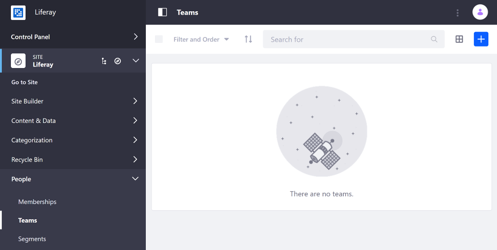
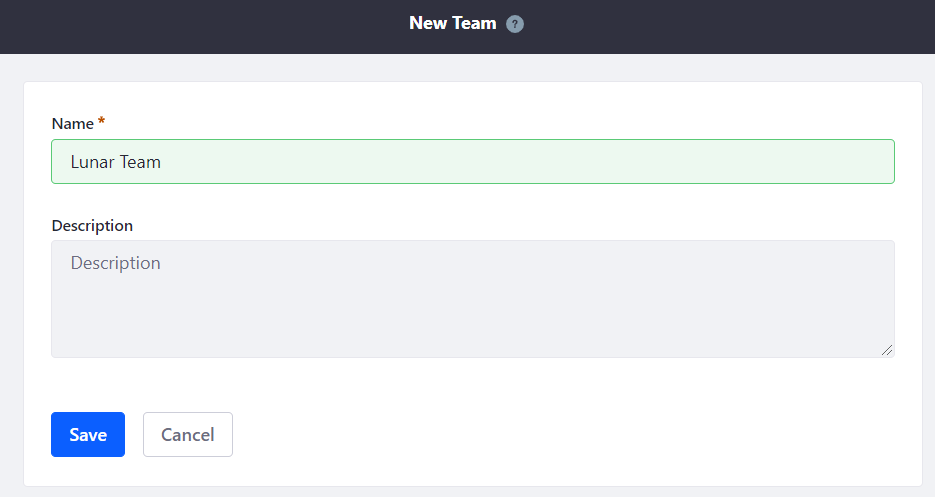

# Creating Teams for Sites

If you have an *ad hoc* group of Users who perform the same set of tasks in a Site (moderating a site's Wiki content, managing Message Boards threads, writing blogs, editing a specific page in the Site, etc.), you can organize them into Site Teams, and then assign the team permissions for various Site-specific functions. Site Teams are the preferred method for administering permissions within a single Site. The permissions assigned to a Site Team only apply to that Site.

```{note}
To create and apply permissions for a group of Users to use across multiple Sites or Organizations in your Liferay Portal instance, consider aggregating the Users into a [User Group](../../../users-and-permissions/user-groups/creating-and-managing-user-groups.md) and assigning the User Group permissions via [Roles](../../../users-and-permissions/roles-and-permissions/understanding-roles-and-permissions.md).
```

The steps below cover these topics:

* [Adding a Team to a Site](#adding-a-team-to-a-site)
* [Adding Members to a Team](#adding-members-to-a-team)
* [Managing Team Permissions](#managing-team-permissions)
* [Managing Team App Permissions](#managing-team-app-permissions)

## Adding a Team to a Site

1. Open the Product Menu and open your Site's menu.
1. Select *People* &rarr; *Teams*.

    

    ```{note}
    You can configure other Site membership groupings, such as *Users*, *Organizations*, and *User Groups* in the *Site Memberships* app, which is also in the *Members* tab. See [Changing Site Membership Type](../../site-settings/site-users/changing-site-membership-type.md) for more information on how Site memberships work.
    ```

1. Click the *Add Team* icon ().

1. Enter a name and a description and click *Save*. Your new Team is displayed in the list.



## Adding Members to a Team

1. Click on the Team name link.

1. Click the Add button ().

1. Select the Users to add to the Team and click *Add*.

## Managing Team Permissions

1. Click the *Actions* icon () next to the Team and select *Permissions*.

    ```{note}
    Setting permissions for the Team assigns those permissions to all the Team's members. Only Administrators who can edit/manage the Team can manage Team permissions.
    ```

1. Check/uncheck the permissions and click *Save*.

## Managing Team App Permissions

You can also manage Team permissions from an app.

1. Open the Product Menu and select the app under the Site's menu (Message Boards for example).

1. Open the *Options* () Menu in the top right of the screen and select the *permissions*-related option.

1. Find the Team in the Role column and select the appropriate permissions.


