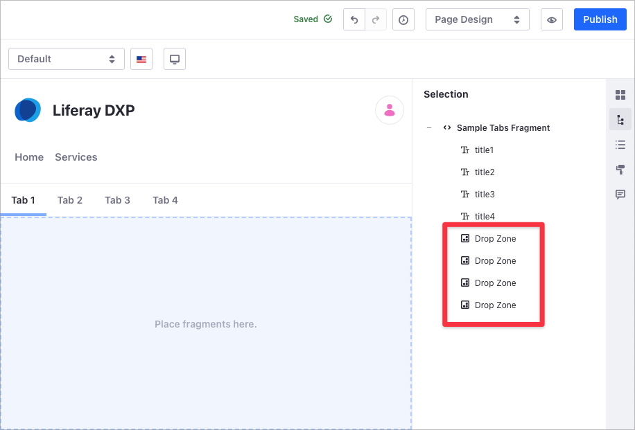
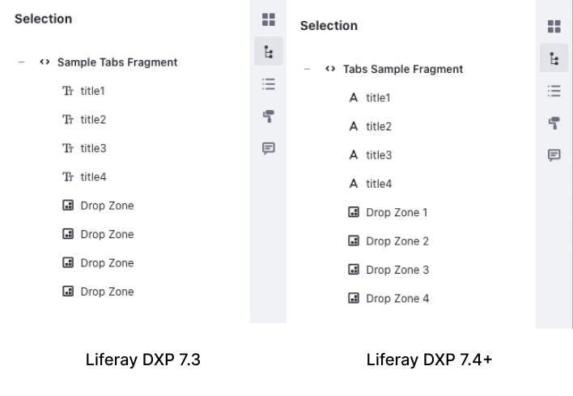

# Defining Fragment Drop Zones

Drop zones are integral to building your Content Pages. With them, you can create unique Page layouts and dynamic displays by defining areas within Fragments where Users can drag and drop other Fragments and widgets.

Follow these steps to define a drop zone:

1. Go to *Site Administration* &rarr; *Design* &rarr; *Fragments*.
1. Under Collections, select the Collection with the Fragment you want to edit.
1. Click the Fragment's *Actions* () button and select *Edit* to open the [Fragments Editor](./using-the-fragments-editor.md).
1. In the HTML code area, add the `<lfr-drop-zone></lfr-drop-zone>` label to define a drop zone within a Fragment.

   ```{important}
   Drop zones cannot be added to editable elements within a fragment.
   ```

The following code excerpt shows how to use this label to define drop zones within a Tabs Fragment:

   ```html
      <div class="tab-panel">
         [#list 0..configuration.numberOfTabs-1 as i]
         <div aria-labelledby="tab${i+1}" class="tab-panel-item d-none" data-fragment-namespace="${fragmentEntryLinkNamespace}" id="tabPanel${i+1}" role="tabpanel" tabindex="0">
            <lfr-drop-zone></lfr-drop-zone>
         </div>
         [/#list]
      </div>
   ```

This image shows the result in the Content Page editor sidebar:



Once defined, you can drag and drop any Fragment or widget into the drop zone.

## Identifying the Drop Zones in the Fragment Code

> Available in Liferay DXP 7.4+.

If you want to identify the drop zones, include the `data-lfr-drop-zone-id` HTML attribute in the `<lfr-drop-zone></lfr-drop-zone>` label. The Fragments you create in Liferay DXP 7.4+ include the `data-lfr-drop-zone-id` HTML attribute by default.



The following example demonstrates how to use the `data-lfr-drop-zone-id` attribute to identify drop zones within the Tabs Fragment:

   ```html
      <div class="tab-panel">
         [#list 0..configuration.numberOfTabs-1 as i]
         <div aria-labelledby="tab${i+1}-${fragmentEntryLinkNamespace}" class="tab-panel-item d-none" data-fragment-namespace="${fragmentEntryLinkNamespace}" id="tabPanel${i+1}-${fragmentEntryLinkNamespace}" role="tabpanel" tabindex="0">
            <lfr-drop-zone data-lfr-drop-zone-id="${i+1}"></lfr-drop-zone>
         </div>
         [/#list]
      </div>
   ```

   ```{tip}
   You can configure the order of the drop zones and other elements in the Fragment. For more information, see [Setting the Order of Elements in a Fragment](./setting-the-order-of-elements-in-a-fragment.md).
   ```

## Additional Information

- [Developing Fragments](./developing-fragments-intro.md)
- [Using the Fragments Editor](./using-the-fragments-editor.md)
- [Using the Fragments Toolkit](./using-the-fragments-toolkit.md)
- [Setting the Order of Elements in a Fragment](./setting-the-order-of-elements-in-a-fragment.md)
