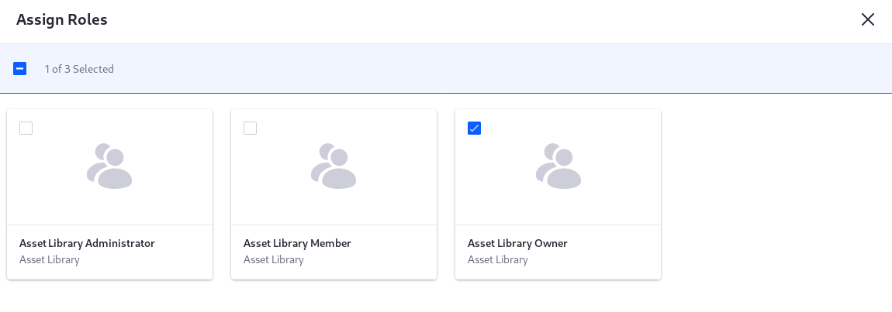
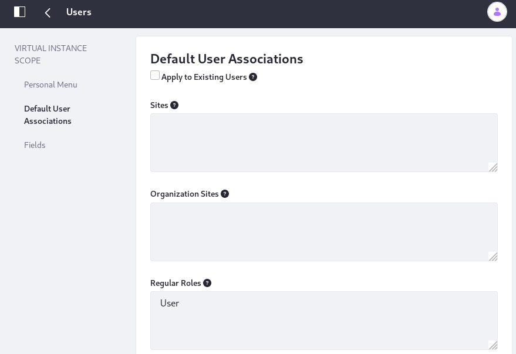

# Assigning Users to Roles

The location of a Role's assignment UI corresponds with the [Role's scope](./understanding-roles-and-permissions.md#roles-and-scope).

## Regular Roles

Globally scoped regular roles are available for configuration in the DXP [Control Panel](../../getting-started/navigating-dxp.md#control-panel).

| Permission Scope | Available Assignments |
| ---------------- | --------- |
| Throughout the Virtual Instance (global) | User Groups <br />Organizations <br />Sites <br />Segments <br />Individual Users |

You can assign Users to a Regular Role in the Assignees tab of the Add/Edit Role form.

1. Go to Control Panel &rarr; Users &rarr; Roles, and click on a Regular Role.

1. In the Assignees tab of the Add/Edit Role form, click the tab for the assignment type you need. Regular Roles are assigned to Users, Sites, Organizations, User Groups, or User Segments.

1. Click the Add button .

1. Select the assignees and click *Add*.

   If assigning a group, all Users assigned to that group inherit the Role.


## Site Roles

You can assign Users to a Site Role in the Memberships section of a Site's People sub-menu.

| Permission Scope | Available Assignments |
| ---------------- | --------- |
| A single Site    | User Groups <br />Organizations <br />Segments <br />Individual Site Members |

1. Go to Site Menu &rarr; People &rarr; Memberships.

1. Click the tab for the membership type you're assigning the Role. Site Roles are assigned to Users (i.e., individual Site members), Organizations, or User Groups.

1. Click the Actions button  &rarr; Assign Roles.

1. Choose the Roles to assign and click *Done*.

   If assigning a group, all Users assigned to that group inherit the Role.


```{note}
As of Liferay CE 7.3.1 GA2 and Liferay DXP 7.2 SP3+, you can assign Site Roles to [User Segments](../../site-building/personalizing-site-experience/segmentation/creating-and-managing-user-segments.md)_. See [Assigning Roles to User Segments](./assigning-roles-to-user-segments.md) for more details.
```

## Organization Roles

You can assign Users to a Organization Role in the Organizations tab of the Users and Organizations Control Panel section.

| Permission Scope | Available Assignments |
| ---------------- | --------- |
| A single Organization | Individual Users |

1. Go to Control Panel &rarr; Users &rarr; Users and Organizations, and click on the _Organizations_ tab.

1. Click the Actions button  for the Organization and choose _Assign Organization Roles_.

1. Choose the Role to assign and you see the current assignees listed.

1. To add new assignees, click the _Available_ tab to see the Organization members that can be assigned to the Role.

1. Choose the assignees, then click _Update Associations_.


## Asset Library Roles

Making Role assignments for Asset Libraries is nearly identical to making assignments for Sites: assign Users to an Asset Library Role in the Memberships section of the Asset Library's People sub-menu.

| Permission Scope | Available Assignments |
| ---------------- | --------- |
| A single Asset Library | Organizations <br />User Groups <br /> Individual Users |

1. Go to the [Asset Library](../../content-authoring-and-management/asset-libraries/asset-libraries-overview.md) Menu &rarr; People &rarr; Memberships.

1. Click the tab for the membership type you're assigning the Role. Like Sites, Asset Libraries are assigned to Users (i.e., individual Site members), Organizations, or User Groups.

1. Click the Actions button  &rarr; Assign Roles.

1. Choose the Roles to assign and click *Done*.

   If assigning a group, all Users assigned to that group inherit the Role.



<!--
## Account Roles

You can assign Users to an Account Role in the Accounts Control Panel section.

| Permission Scope | Available Assignments |
| ---------------- | --------- |
| A single Account | Individual Account Members

1. Go to Control Panel &rarr; Accounts &rarr; Accounts, and click on the Account of interest.

1. Click the Roles tab for the Account.

1. Choose the Role to assign and you see the current assignees listed.

1. To add new assignees, click the _Available_ tab to see the Account members that can be assigned to the Role.

1. Choose the assignees, then click _Update Associations_.


-->

## Default User Associations

By default, new Users receive only the Users Role, but you can manage the default Role associations to add new Roles or remove the User assignment.

| Permission Scope | Available Assignments |
| ---------------- | --------- |
| Throughout the Virtual Instance (global) | All new Users |

1. Navigate to Control Panel &rarr; Configuration &rarr; Instance Settings.

1. Select the Users category under the PLATFORM section.

1. Click _Default User Associations_ from the left menu.

1. Use the Regular Roles configuration field to enter a comma-separated list of Regular Roles that all new Users should inherit.

Read more in the [Default User Associations](../../system-administration/virtual-instances/users.md#default-user-associations) documentation.



Assignment is important, but a Role isn't worth the database row it occupies without permissions. Read about [defining permissions](./defining-role-permissions.md) for a Role next.
