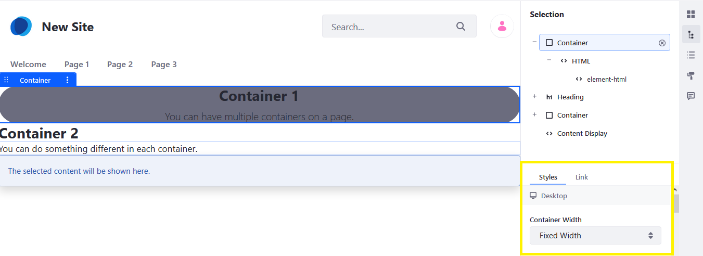

# フラグメントスタイルの設定

フラグメントスタイルを使用して、ページフラグメントのルックアンドフィールをカスタマイズできます。 枠線を追加したり、フォントや背景色を変更したり、背景画像をアップロードしたりできます。 使用可能なすべてのスタイルの完全なリストについては、[Fragment Styles Reference](./fragment-styles-reference.md)を参照してください。 使用可能なスタイリングオプションはスタイルブックで定義されています。詳細は、[新しいスタイルブックの作成](../../site-appearance/using-a-style-book-to-standardize-site-appearance.md)を参照してください。

```{tip}
スタイルの多くはCSSクラスに対応しています。 CSSの知識がある方は、多くのフィールドに見覚えがあるでしょう。
```

フラグメントのスタイルを設定するには：

1.  コンテンツが公開されているサイトに移動します。

2.  コンテントページで*[編集する]* をクリックします。

3.  目的のフラグメントを選択します（たとえば、*コンテナフラグメント*や*HTML*）。

4.  *選択* （）アイコンをクリックします。

5.  *[スタイル]* タブをクリックします。

6.  フラグメントのスタイルを必要に応じて設定します。

    

7.  完了したら、*[Publish]* をクリックします。

フラグメントのスタイルが更新されました。

## 追加情報

  - [Content Pages Overview](./content-pages-overview.md)
  - [フラグメントの使用](./using-fragments.md)
  - [Fragment Styles Reference](./fragment-styles-reference.md)
  - [新しいスタイルブックの作成](../../site-appearance/using-a-style-book-to-standardize-site-appearance.md)
  - [Style Book Tokens](../../site-appearance/developer-guide/style-book-token-definitions.md)
