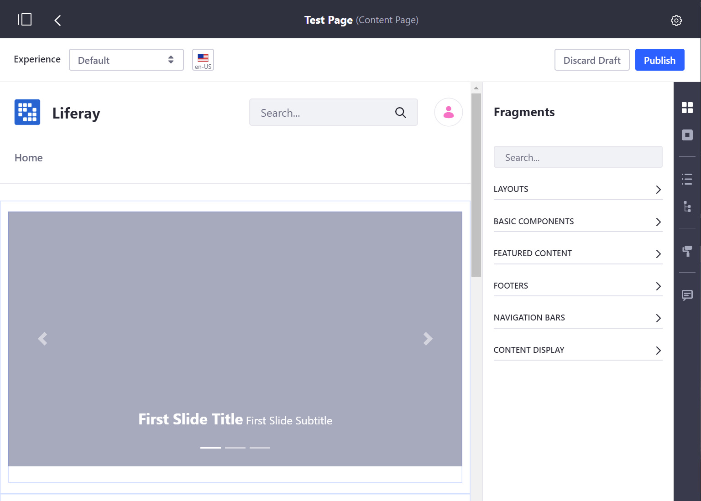

# コンテンツページの概要

Liferay DXPで使用されるデフォルトのページタイプはコンテンツページです。 コンテンツページ編集UIを使用すると、最小限の構成ですぐに使用できるさまざまなドラッグアンドドロップ要素（フラグメント）にアクセスできます。 続きを読み進め、コンテンツページUIの概要を確認してください。 コンテンツページの作成に直接移動するには、[Building Content Pages](./building-content-pages.md)を参照してください。



コンテンツページのサイドバーには、コンテンツページ用の次の要素とツールが含まれています。

  - [フラグメント](#fragments)
  - [ウィジェット](#widgets)
  - [コンテンツ](#contents)
  - [ページ構造](#page-structure)
  - [ルックアンドフィール](#look-and-feel)
  - [コメント](#comments)

Liferay Portalには、ページの作成に使用できるいくつかのレイアウト、フラグメント、およびウィジェットが付属しています。 開発者は、[独自のフラグメントを作成](./README.md#dev-guide)してこれらに追加できます。

## フラグメント

```{note}
Liferay DXP 7.3以降で利用できます。 このセクションは、以前は[*Sections*]パネルと[*Section Builder*]パネルに分かれていました。
```

ページにフラグメントをドラッグアンドドロップできます。 フラグメントには、[テキスト](./building-content-pages.md#modify-editable-text)、[画像](./building-content-pages.md#modify-editable-images)、[リンク](./building-content-pages.md#modify-editable-links)などの編集可能な要素を含めることができ、カスタムコンテンツで置き換えることができます。 サイト自体ですでに利用可能なコンテンツに[これらの要素をマッピング](./building-content-pages.md#mapping-elements)することもできます。 これらの要素の開発の詳細については、[Fragment Specific Tags](./README.md#using-fragments)を参照してください。

### レイアウト

レイアウトは、フラグメントまたはウィジェットを追加できるキャンバスを提供します。 追加する各レイアウトによって、ページの幅が調整されます。 複数のレイアウトをページに追加できます。

![[Layouts]セクションには、フラグメントを整理するためのレイアウトが含まれています。](content-pages-overview/images/16.png)

### 基本コンポーネント

基本コンポーネントは、ページに機能を追加する小さなデザイン要素または部品です。 コンポーネントには、フォーマットが設定された画像や、スタイルが事前に適用されたテキストのブロックなどがあります。 コンポーネントが連携して、ページを1つずつ構築します。


### 注目コンテンツ

[Featured Content]パネルには、（複数のコンポーネントで構成される）完全なフラグメントが含まれており、ページに追加するとすぐに使用およびカスタマイズできます。 テキストオーバーレイとカスタマイズ可能なCTA（Call to Action）が設定された大きなバナー画像は、すぐに使用できる状態のフラグメントの例です。

<!-- An image with better text contrast would probably be a better example here - to help the image / text / CTA button stand out from one another more. -->

![コンテンツページの編集中に[Banner]という名前のセクションが表示されます。](./content-pages-overview/images/01.png)

### フッター

```{note}
Liferay DXP 7.3以降で利用できます。 これらのフラグメントは、以前は[*Sections*]パネルに含まれていました。
```

*[Footers]* パネルには、ページのフッターとして追加できるフラグメントが含まれています。 Liferay DXP 7.3での使用については、[Master Pages](./README.md#creating-pages)を参照してください。

### ナビゲーションバー

```{note}
Liferay DXP 7.3以降で利用できます。 これらのフラグメントは、以前は[*Sections*]パネルに含まれていました。
```

*[Navigation Bars]* パネルには、ページのヘッダーとして追加できるフラグメントが含まれています。 Liferay DXP 7.3での使用については、[Master Pages](./README.md#creating-pages)を参照してください。

### コンテンツ表示

```{note}
Liferay DXP 7.3以降で利用できます。
```
*[Content Display]* セクションでは、コンテンツ表示フラグメントを追加して、単一の既存のWebコンテンツ、ブログエントリ、またはドキュメントを表示できます。 詳細については、[Using the Content Display Fragment](./README.md#using-fragments)を参照してください。 <!--Including this doc in the Page Fragments section-->

## ウィジェット

<!-- Suggestion for improving this content:

Rather than spend valuable real estate here comparing to how its different from a widget page - we should focus on what it is here:

"The widgets section shows a full list of out of the box applications and tools. There are some limitations to using a widget on a content page that distinguish it from its use on a widget page. See "Using Widgets on a Content Page" for more information."

-->

[Widgets]セクションは、 	ウィジェットページの*[Add]* メニューと同様に機能します。 使用可能なウィジェットの完全なリストが表示され、それらをページに追加できます。 主な違いは、コンテンツページのウィジェットの主要な設定オプションのみが表示される点です。 *ルックアンドフィール*のような他の様々な設定は、ウィジェットページのウィジェットに対してのみ利用できます。

![[Widgets]セクションには、レイアウト内に追加できるウィジェットのリストが表示されます。](./content-pages-overview/images/06.png)

## コンテンツ

```{note}
Liferay DXP 7.3以降で利用できます。
```

[Contents]セクションには、ページで使用されているWebコンテンツのリストが表示されます。 ウィジェットに表示されるコンテンツやコンテンツフィールドにマップされたコンテンツなどがあります。 *コンテンツ*ボタン（）をクリックして、[Contents]パネルを開きます。 このセクションから、さまざまなアクションを実行して、Webコンテンツを編集および管理できます。 詳細については、[Managing Web Content on Content Pages](./managing-web-content-on-content-pages.md)を参照してください。

## ページ構造

[Page Structure]には、ページ上の各フラグメント内のすべてのフラグメントとフィールドが階層表示されます。 ページ構造内のフィールドをクリックすると、ページ上で強調表示され、他の要素の中ですばやく見つけることができます。

![[Page Structure]では、ページの階層が表示されます。](./content-pages-overview/images/08.png)

## ルックアンドフィール

*ルックアンドフィール*アイコン（）をクリックして、テーマを変更したり、ページの他のオプションを管理したりします。 これらのオプションについては、[Configuring Individual Pages](./06-configuring-individual-pages.md#look-and-feel)でさらに詳しく説明します。

## コメント

ページフラグメントにコメントして、変更について議論したり、コラボレーションすることができます。 Liferay DXP 7.2以降では、コメントはデフォルトで無効になっていますが、管理者はコメントを有効にできます。 詳細については、[Using Fragment Comments](./using-fragment-comments.md)を参照してください。

## 次のステップ

  - [Building Content Pages](./building-content-pages.md)
  - [Page Fragments](./README.md#using-fragments)
  - [Using Fragment Comments](./using-fragment-comments.md)
